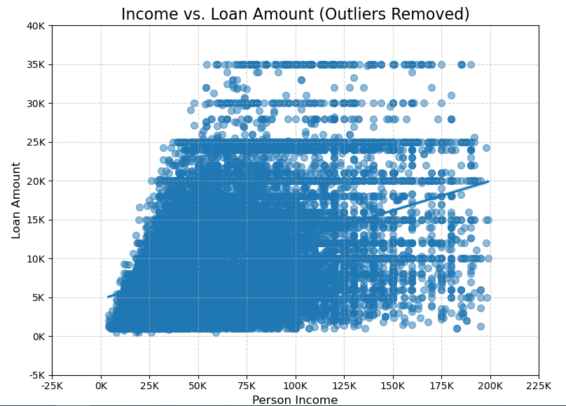

# Credit Risk Portfolio Project Report

## Project Objective
The objective of this project is to analyze a credit risk dataset to build predictive models for loan default and interest rates. The project aims to explore key factors influencing loan approval rates, defaults, and interest rates using machine learning algorithms. It also involves generating visual insights through data analysis.

## Dataset Description
The dataset consists of 24 features related to individuals applying for loans. Key features include:

- **person_age:** Age of the loan applicant.
- **person_income:** Annual income of the applicant.
- **person_home_ownership:** Homeownership status (e.g., RENT, OWN).
- **person_emp_length:** Length of employment.
- **loan_intent:** Purpose of the loan (e.g., MEDICAL, EDUCATION, PERSONAL).
- **loan_grade:** Credit grade assigned to the applicant.
- **loan_amnt:** Loan amount requested.
- **loan_int_rate:** Interest rate assigned to the loan.
- **loan_status:** Indicates whether the loan was approved (1) or not (0).
- **loan_percent_income:** Proportion of the loan amount to the applicant's income.

The dataset includes both numerical and categorical variables. Missing values were handled by filling with the median (for employment length) and the mean (for loan interest rate).

## Methodology
### Data Preprocessing
```python
# Load the dataset
file_path = r"C:\Users\itsgo\Documents\Credit Data\credit_risk_dataset.csv"
credit_data = pd.read_csv(file_path)

# Fill missing values
credit_data['person_emp_length'].fillna(credit_data['person_emp_length'].median(), inplace=True)
credit_data['loan_int_rate'].fillna(credit_data['loan_int_rate'].mean(), inplace=True)

# Convert categorical columns to numerical using one-hot encoding
credit_data_encoded = pd.get_dummies(credit_data, columns=['person_home_ownership', 'loan_intent', 'loan_grade', 'cb_person_default_on_file'])
```

### Modeling and Evaluation
#### Logistic Regression for Loan Default Prediction
```python
# Prepare data for modeling
X = credit_data_encoded.drop(['loan_status'], axis=1)
y = credit_data_encoded['loan_status']

# Split data into training and test sets
X_train, X_test, y_train, y_test = train_test_split(X, y, test_size=0.3, random_state=42)

# Train a Logistic Regression model
logistic_model = LogisticRegression(max_iter=1000)
logistic_model.fit(X_train, y_train)

# Predict and evaluate
y_pred = logistic_model.predict(X_test)
print("\nClassification Report for Loan Default Prediction:")
print(classification_report(y_test, y_pred))
```

### Classification Results
- The classification model achieved an accuracy of 80%.
- Precision, recall, and F1-scores varied between approved and defaulted loans. The recall for defaulted loans (class 1) was relatively low, indicating the model struggled to correctly identify these cases.


```python
# Confusion matrix visualization
conf_matrix = confusion_matrix(y_test, y_pred)
sns.heatmap(conf_matrix, annot=True, fmt='d', cmap='Blues')
plt.title("Confusion Matrix for Loan Default Prediction")
plt.xlabel("Predicted")
plt.ylabel("Actual")
plt.show()
```

#### Linear Regression for Interest Rate Prediction
```python
# Prepare data for modeling interest rate
X_interest = credit_data_encoded.drop(['loan_int_rate'], axis=1)
y_interest = credit_data_encoded['loan_int_rate']

# Train-test split
X_train_i, X_test_i, y_train_i, y_test_i = train_test_split(X_interest, y_interest, test_size=0.3, random_state=42)

# Train a Linear Regression model
linear_model = LinearRegression()
linear_model.fit(X_train_i, y_train_i)

# Predict and evaluate
y_pred_i = linear_model.predict(X_test_i)
print("\nMean Squared Error for Loan Interest Rate Prediction:", mean_squared_error(y_test_i, y_pred_i))
print("R2 Score:", r2_score(y_test_i, y_pred_i))
```

### Regression Results
- The linear regression model achieved an R2 score of 0.822, indicating a strong fit.
- The mean squared error was 1.71, showing reasonable accuracy in predicting loan interest rates.


```python
# Scatter plot of actual vs. predicted interest rates
plt.scatter(y_test_i, y_pred_i, alpha=0.5)
plt.title("Actual vs. Predicted Loan Interest Rates")
plt.xlabel("Actual Interest Rate")
plt.ylabel("Predicted Interest Rate")
plt.show()
```

### Analysis of Loan Approval Rates
#### By Home Ownership
```python
# Approval rate by home ownership
approval_rate = credit_data.groupby('person_home_ownership')['loan_status'].mean()

# Bar plot for approval rate by home ownership
approval_rate.plot(kind='bar', color='skyblue')
plt.title("Loan Approval Rate by Home Ownership")
plt.xlabel("Home Ownership")
plt.ylabel("Approval Rate")
plt.show()
```


#### By Loan Intent
```python
# Approval rate by loan intent
plt.figure(figsize=(10, 6))
sns.barplot(x='loan_intent', y='loan_status', data=credit_data, errorbar=None, palette='viridis')
plt.xticks(rotation=45)
plt.title("Loan Approval Rate by Loan Intent", fontsize=16)
plt.xlabel("Loan Intent", fontsize=12)
plt.ylabel("Approval Rate", fontsize=12)
plt.tight_layout()
plt.show()
```


### Income vs. Loan Amount
```python
# Remove outliers: Focus on incomes below 200,000 and loan amounts below 100,000
filtered_data = credit_data[(credit_data['person_income'] < 200000) & (credit_data['loan_amnt'] < 100000)]

# Scatter plot with regression line after filtering outliers
plt.figure(figsize=(8, 6))
sns.regplot(x='person_income', y='loan_amnt', data=filtered_data, scatter_kws={'alpha': 0.5, 's': 50})
plt.title("Income vs. Loan Amount (Outliers Removed)", fontsize=16)
plt.xlabel("Person Income", fontsize=12)
plt.ylabel("Loan Amount", fontsize=12)
plt.xticks(ticks=plt.xticks()[0], labels=[f'{int(x / 1000)}K' for x in plt.xticks()[0]])
plt.yticks(ticks=plt.yticks()[0], labels=[f'{int(y / 1000)}K' for y in plt.yticks()[0]])
plt.grid(True, linestyle='--', alpha=0.6)
plt.tight_layout()
plt.show()
```



## Conclusion
The analysis revealed important factors influencing loan defaults and interest rates. Logistic regression showed moderate success in classifying loan statuses, while linear regression effectively predicted interest rates. Key findings include:

- Class imbalance impacted the classification model’s performance.
- Loan approval rates are influenced by both home ownership and loan intent.
- Higher-income applicants tend to secure larger loans.

Future improvements could include addressing class imbalance with techniques such as SMOTE or rebalancing the dataset, exploring other algorithms like decision trees or gradient boosting, and fine-tuning hyperparameters to enhance model performance.
