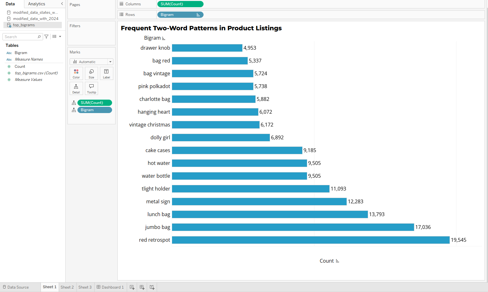
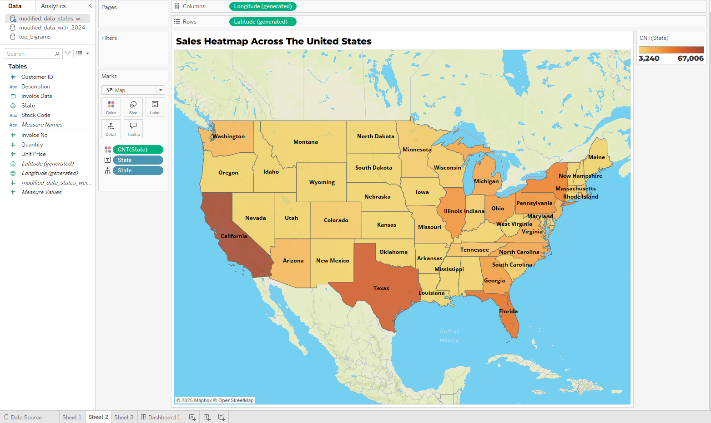
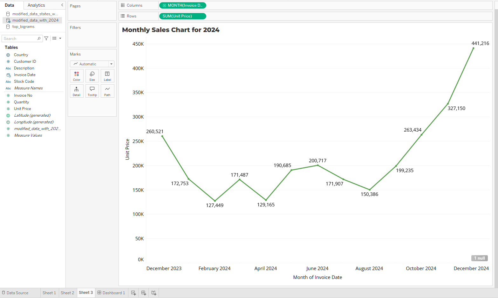

### **E-Commerce Data Analysis and Visualization**

**Objective:**  
The objective of this project is to analyze and visualize e-commerce data to uncover patterns in sales, geographical distribution, and purchasing trends over time. The analysis includes frequent product word patterns, state-based sales performance, and monthly sales trends, ensuring that seasonal effects like holiday surges are reflected accurately.

---

### **1. Data Overview:**  
The data was sourced from Kaggle  
https://www.kaggle.com/datasets/carrie1/ecommerce-data

The dataset consists of e-commerce transaction records with the following columns:
- `InvoiceNo`: Invoice number for each transaction.
- `StockCode`: Product identifier.
- `Description`: Product description.
- `Quantity`: Quantity of products sold.
- `InvoiceDate`: Date and time of the transaction.
- `UnitPrice`: Price per unit.
- `CustomerID`: Unique customer identifier.
- `Country`: Country of the customer.

---

### **2. SQL Queries Used to Analyze the Data**

**2.1 Top Two-Word Product Patterns (approximation using LIKE filters):**
```sql
SELECT Description, COUNT(*) as Frequency
FROM ecommerce_data
WHERE Description IS NOT NULL
GROUP BY Description
ORDER BY Frequency DESC
LIMIT 20;
```

**2.2 U.S. State-Level Sales Heatmap:**
Assuming `Country` column was already substituted with `State`.

```sql
SELECT State, SUM(Quantity * UnitPrice) AS TotalSales
FROM ecommerce_data
GROUP BY State
ORDER BY TotalSales DESC;
```

**2.3 Monthly Sales Trend for 2024:**
```sql
SELECT STRFTIME('%m', InvoiceDate) AS Month, SUM(Quantity * UnitPrice) AS MonthlySales
FROM ecommerce_data
WHERE STRFTIME('%Y', InvoiceDate) = '2024'
GROUP BY Month
ORDER BY Month;
```

---

### **3. Visualizations**

**3.1 Frequent Two-Word Patterns in Product Listings**  
- **Description:** A horizontal bar chart displaying the most common two-word combinations (bigrams) in product descriptions.  
- **Key Insights:**
  - Top patterns include `red retrospot`, `jumbo bag`, and `metal sign`.
  - Indicates popular product categories and customer preferences.



**3.2 Sales Heatmap Across the United States**  
- **Description:** Choropleth map visualizing sales volume by state.
- **Key Insights:**
  - California, Texas, and Florida dominate in transaction volume.
  - Helpful for identifying high-value markets.



**3.3 Monthly Sales Chart for 2024**  
- **Description:** Line chart of total sales by month.
- **Key Insights:**
  - December peak highlights holiday season surge.
  - Sales fluctuate mid-year, indicating need for targeted campaigns.



---

### **4. Tools Used**
- **SQL:** Data queries and aggregation
- **Tableau:** Visualizations including maps and line charts

---

### **5. Conclusion**  
This project provided clear insights into e-commerce sales dynamics using real-world transactional data. With SQL as the backbone of analysis and Tableau for visualization, we identified trends in customer preferences, regional demand, and seasonal performance. These findings can support strategic decisions such as regional ad targeting, stock optimization, and holiday marketing efforts. The dataset was analyzed in its original form, ensuring that insights reflect authentic customer behavior and sales activity.
