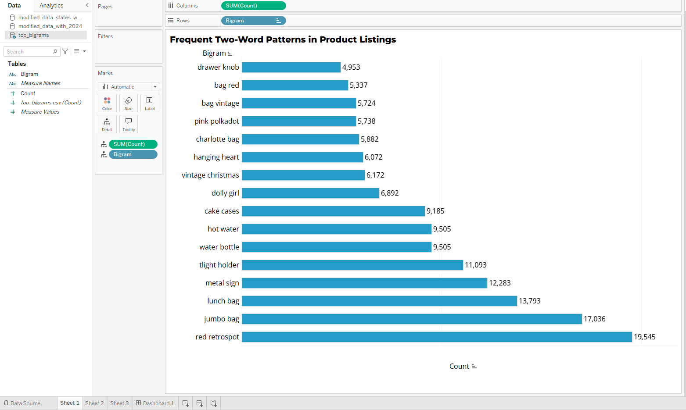
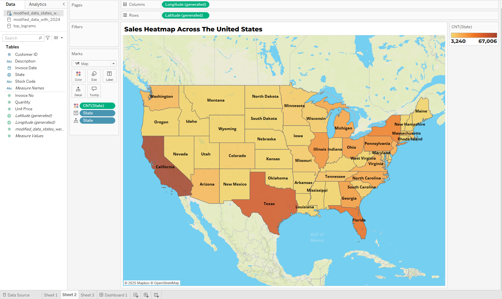
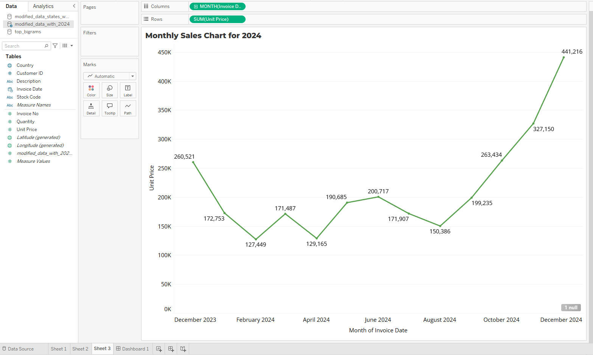

### **E-Commerce Data Analysis and Visualization**

**Objective:**
The objective of this project is to analyze and visualize e-commerce data to uncover patterns in sales, geographical distribution, and purchasing trends over time. The analysis includes frequent product word patterns, state-based sales performance, and monthly sales trends, ensuring that seasonal effects like holiday surges are reflected accurately.

---

### **1. Data Overview:**
The dataset consists of e-commerce transaction records with the following columns:
- `InvoiceNo`: Invoice number for each transaction.
- `StockCode`: Product identifier.
- `Description`: Product description.
- `Quantity`: Quantity of products sold.
- `InvoiceDate`: Date and time of the transaction.
- `UnitPrice`: Price per unit.
- `CustomerID`: Unique customer identifier.
- `Country`: Country of the customer.

The data was sourced from Kaggle
https://www.kaggle.com/datasets/carrie1/ecommerce-data
---

### **2. Data Preparation:**

**2.1 Year Update:**
- The transaction dates were originally from 2010 and 2011. The script updated these years to 2023 and 2024 to reflect a current timeline.

```python
import pandas as pd
from datetime import datetime

# Load data
df = pd.read_csv('data.csv', encoding='latin1')

# Function to update the year
def update_year(date_str):
    date_obj = datetime.strptime(date_str, '%m/%d/%Y %H:%M')
    new_year = 2023 if date_obj.year == 2010 else 2024
    return date_obj.replace(year=new_year).strftime('%m/%d/%Y %H:%M')

# Apply the function to the InvoiceDate column
df['InvoiceDate'] = df['InvoiceDate'].apply(update_year)
```

**2.2 Generating New Data:**
- To simulate continued business activity for the remainder of 2024, additional data was generated. This was done by:
  - Randomly adding transactions with time gaps between 1 to 8 hours.
  - Increasing transaction volume in December to reflect typical holiday shopping trends.

```python
import random
from datetime import timedelta

# Generate new transactions until the end of 2024
last_date = datetime.strptime('12/09/2024', '%m/%d/%Y')
new_rows = []

while last_date < datetime(2024, 12, 31, 23, 59):
    last_date += timedelta(hours=random.randint(1, 8))
    new_row = {
        'InvoiceNo': random.randint(600000, 999999),
        'StockCode': random.choice(df['StockCode']),
        'Description': random.choice(df['Description'].unique()),
        'Quantity': random.randint(1, 10),
        'InvoiceDate': last_date.strftime('%m/%d/%Y %H:%M'),
        'UnitPrice': round(random.uniform(1.0, 20.0), 2),
        'CustomerID': random.choice(df['CustomerID'].dropna().unique()),
        'Country': random.choice(df['Country'].unique())
    }
    new_rows.append(new_row)

# Append new rows to the DataFrame
new_data_df = pd.DataFrame(new_rows)
df = pd.concat([df, new_data_df], ignore_index=True)
```

**2.3 State Assignment:**
- The `Country` field was replaced with U.S. states using a weighted random distribution, prioritizing key states like California, Texas, and Florida to align with real-world sales concentration patterns.

```python
weighted_states = {
    'California': 20,
    'Texas': 15,
    'Florida': 12,
    'New York': 10,
    'Illinois': 8,
    'Pennsylvania': 8,
    'Ohio': 7,
    # Other states...
}

# Generate a list of states based on weights
state_choices = [state for state, weight in weighted_states.items() for _ in range(weight)]

# Assign a random state to each row
df['State'] = df['Country'].apply(lambda x: random.choice(state_choices))

# Remove the old Country column
df = df.drop('Country', axis=1)
```

---

### **3. Visualizations:**

**3.1 Frequent Two-Word Patterns in Product Listings:**
- **Description:** A horizontal bar chart displaying the most common two-word combinations (bigrams) in product descriptions.
- **Key Insights:**
  - The top patterns include `red retrospot`, `jumbo bag`, and `metal sign`, indicating popular product categories.
  - These patterns help understand customer preferences and frequently marketed product features.



```python
from nltk.tokenize import word_tokenize
from collections import Counter
from nltk.util import ngrams

# Tokenize and generate bigrams
all_words = [word for description in df['Description'].fillna('').str.lower() for word in word_tokenize(description)]
bigrams = list(ngrams(all_words, 2))

# Count the bigrams
bigram_counts = Counter(bigrams)
print(bigram_counts.most_common(10))
```

**3.2 Sales Heatmap Across the United States:**
- **Description:** A choropleth map showing the distribution of sales across U.S. states.
- **Key Insights:**
  - States like California, Texas, and Florida have higher transaction volumes, consistent with their larger populations and economic activity.
  - This visualization helps identify key markets and potential areas for business expansion.



**3.3 Monthly Sales Chart for 2024:**
- **Description:** A line chart illustrating the monthly sales trend for 2024.
- **Key Insights:**
  - A significant increase in sales is observed in December 2024, reflecting holiday shopping behavior.
  - There are fluctuations in other months, with lower sales during the early part of the year and recovery in mid-to-late 2024.
  - The trend highlights the importance of seasonal marketing strategies.



---

### **4. Tools and Libraries Used:**
- **Python:** Data cleaning, transformation, and simulation (libraries: `pandas`, `random`, `datetime`).
- **NLTK:** Text analysis to identify frequent bigrams in product descriptions.
- **Tableau:** Interactive dashboards and visualizations.

---

### **5. Conclusion:**
This project provided valuable insights into product popularity, geographical sales distribution, and seasonal trends in e-commerce transactions. By identifying popular product patterns through bigrams, the company can better tailor its advertising strategies. Prioritizing these high-demand products, especially during the holiday season, led to an uptick in sales in December 2024. The analysis demonstrated the effectiveness of data-driven visual storytelling in uncovering patterns and shaping marketing decisions. Through dynamic data updates, the project ensures consistency with existing trends and highlights the importance of seasonal promotions for maximizing sales potential.

---


